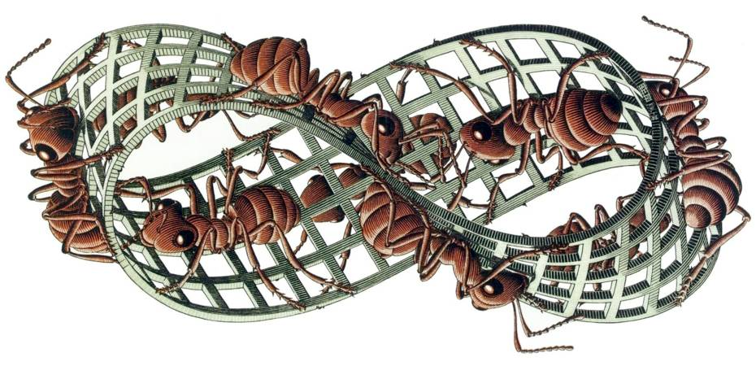

===================================
Generators, iterators and Iterables
===================================

.. Hello I'm Andrea Crotti and I'm going to talk you about today about generators, iterators and iterables.
.. I currently work in London for a web startup called Wazoku and all the code I'm going to show you is written for Python3 only, but I will have a slide later to point out what are the changes between Python2 and Python3 that affect the code in this talk.

Twitter: @andreacrotti

Slides: https://github.com/AndreaCrotti/generators

**Python3 only code ahead!**

.. image:: img/wazoku.png
   :height: 70

Agenda
======

- what is a generator/iterable/iterator?
- how do I use/define them?
- why they are so cool?

Even numbers
============

Generate *even* numbers:

.. literalinclude:: code/generators.py
    :pyobject: is_even

.. literalinclude:: code/generators.py
    :pyobject: classic_even_gen

*Any problem with that??*
    

First n even numbers?
=====================

How do I get the first 10 even numbers?

.. literalinclude:: code/generators.py
    :pyobject: classic_ten_first_even

**BORING**

Composability
=============

.. the generation function contains all the logic

What if I could do this?

*I want to reuse the generation function*

.. literalinclude:: code/generators.py
    :pyobject: ten_first_even

Which is equivalent to:

.. literalinclude:: code/generators.py
    :pyobject: ten_first_even_yield

Teaser
======

Infinite list of even numbers:

.. code-block:: haskell

   even = [x | x <- [0..], x `mod` 2 == 0]

Awesome, but in Python?

.. rst-class:: build

.. code-block:: python

    (x for x in itertools.count(0) if x % 2 == 0)

Definitions
===========

.. now it's time to give some definitions (in a top down matter)
   before we jump in showing some code.
.. The awesome oneliner I've just shown is a generator expression,
   which is syntactic sugar to yield new generator objects.

.. A generator is a function that returns an iterator, an iterator
.. is an object representing a stream of data, basically something
   that can be looped over with a for loop.

.. And an Iterable at least is any object capable of returning its
   members one at a time.

- *Generator expression*: A generator expression yields a new generator object:

.. code-block:: python

    (x for x in itertools.count(0) if x % 2 == 0)

- *Generator*: A function which returns an iterator:

.. code-block:: python

   def fun():
       yield 42

Definitions 2
=============

- *Iterator*: An object representing a stream of data:

.. code-block:: python

    [1, 2, 3]
    set([1, 2, 3])

- *Iterable*: An object capable of returning its members one at a time:

.. literalinclude:: code/generators.py
    :pyobject: SimpleIterable

For loop
========

Pseudocode execution of a for loop running on an iterator:

::

   while True:
       try:
           it = next(g)
       except StopIteration:
           break
       else:
           body(it)
           continue

For loop (2)
============

.. code-block:: python

   for x in [1, 2, 3]:
       print(x)

.. literalinclude:: code/generators.py
    :pyobject: GenIteratorGetItem

Even numbers
============

With a custom generator:

.. code-block:: python

    (x for x in itertools.count(0) if x % 2 == 0)

.. literalinclude:: code/generators.py
    :pyobject: gen_even

With an iterator:

.. literalinclude:: code/generators.py
   :pyobject: GenIterator

.. TODO: add some information about yield from

Generator vs Iterable
=====================

- Generators are simpler to write
- Generators keep track of the context for you

- Iterables can have more methods defined
- Iterables can have more complex logic

General suggestion: pick a generator unless you need something specific.

Lazyness drawbacks
==================
.. Using generators is the way Python uses to do lazy evaluation.
.. While lazy evaluation is great there can be some cases where it can bite you.
.. This example is artificial but it's also something that can easily happen.

.. TODO: add an example where debugging with a generator is a lot harder

.. literalinclude:: code/generators.py
    :pyobject: overflow_list

.. TODO: show in real time that this fails

Lazyness drawbacks
==================

.. literalinclude:: code/generators.py
    :pyobject: overflow_gen

.. rst-class:: build

The list comprehension *always fails*, the generator only fails when reaching a threshold.

Coroutines
==========

- Coroutines consume values
- Generators produce values

.. literalinclude:: code/generators.py
    :pyobject: grep

Coroutines with values
======================

.. literalinclude:: code/generators.py
    :pyobject: grep_with_result

Python2 to Python3
==================

- itertools.ifilter -> filter
- xrange -> range
- def next(self) -> def __next__(self)
- iterable.next() -> next(iterable)
- **None** -> `yield from PEP 380`_

Generators as lightweight threads
=================================

Example from the monocle_ documentation:

::

    @monocle.o
    def request():
        resp = yield HttpClient.query('http://127.0.0.1:8088/')
        print(resp.code, resp.body)

Why the def
===========

.. One thing that is quite confusing about generators is that
.. we are using the same keyword to define a generator that we use for
   standard function.

.. So the semantic of the function actually changes *just* by the fact
.. that there is at least one yield in its implementation.

Resources
=========

- `generator expression PEP 289`_
- `yield from PEP 380`_
- `simple generator PEP 255`_
- `python glossary`_
- monocle_
- coroutines_
- `generators tricks`_
- `iterators and generators`_
- `rock paper scissors as generators`_
- `python for statement`_

.. _`simple generator PEP 255`: http://www.python.org/dev/peps/pep-0255/
.. _`generator expression PEP 289`: http://www.python.org/dev/peps/pep-0289/
.. _`yield from PEP 380`: http://www.python.org/dev/peps/pep-0380/
.. _`python glossary`: http://docs.python.org/2/glossary.html
.. only for python2 for now apparently
.. _monocle: https://github.com/saucelabs/monocle
.. _coroutines: http://www.dabeaz.com/coroutines/Coroutines.pdf
.. _`generators tricks`: http://linuxgazette.net/100/pramode.html
.. _`iterators and generators`: http://excess.org/article/2013/02/itergen1/
.. _`rock paper scissors as generators`: http://excess.org/article/2013/02/itergen2/
.. _`python for statement`: http://effbot.org/zone/python-for-statement.htm

Sieve of Erathostenes
=====================
 
Sieve of Erathostenes

.. code-block:: haskell

    primesTo m = eratos [2..m]  where
       eratos []     = []
       eratos (p:xs) = p : eratos (xs `minus` [p, p+p..m])

Sieve of Erathostenes Python
============================

.. literalinclude:: code/generators.py
    :pyobject: exclude_multiples

.. literalinclude:: code/generators.py
    :pyobject: sieve

.. literalinclude:: code/generators.py
    :pyobject: sieve_gen

